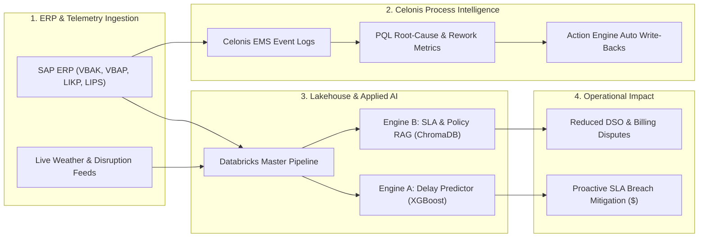

# Hi there, I'm Azhar 👋

[+Intelligence%3BDatabricks+%26+Modern+Data+Pipelines%3BAutonomous+AI+%26+Local+Agentic+Systems)](https://git.io/typing-svg)

  <b>Data Engineer</b> specializing in <b>Celonis Process Mining</b>, high-throughput enterprise pipelines, and autonomous applied AI systems.

---

### 📐 End-to-End Enterprise Data & Process Architecture

---

### 📦 Process Engineering & Capabilities

<table>
  <tr>
    <td width="33%" valign="top">
      <h4>🔍 Celonis & Process Mining</h4>
      <ul>
        <li><b>Process Discovery</b>: Event-log transformation across SAP <code>VBAK</code>, <code>VBAP</code>, <code>LIKP</code>, <code>LIPS</code>.</li>
        <li><b>Advanced PQL</b>: Process cycle time, throughput bottlenecks, and rework rate calculation.</li>
        <li><b>Execution Automation</b>: Action Engine triggers & automated ERP write-backs.</li>
      </ul>
    </td>
    <td width="33%" valign="top">
      <h4>🏗️ Modern Data Engineering</h4>
      <ul>
        <li><b>Lakehouse Architecture</b>: Databricks master jobs, Spark batch transforms, environmental memory caching.</li>
        <li><b>Modern Data Stack</b>: Dimensional star-schema modeling using <b>dbt</b> & <b>DuckDB</b>.</li>
        <li><b>Data Platforms</b>: Snowflake, PostgreSQL, SQLite WAL concurrency.</li>
      </ul>
    </td>
    <td width="33%" valign="top">
      <h4>🤖 Autonomous Applied AI</h4>
      <ul>
        <li><b>Process AI</b>: Dual ML delay forecasting + ChromaDB semantic SLA retrieval.</li>
        <li><b>Acoustic Engine</b>: AMD GPU Vulkan Whisper <code>large-v3</code> speech perception.</li>
        <li><b>Critic Loops</b>: Self-evaluating multi-agent LLM verification pipelines.</li>
      </ul>
    </td>
  </tr>
</table>

---

### 🌟 Production Flagships

<table>
  <tr>
    <td width="50%" valign="top">
      <h3 align="center"><a href="https://github.com/Az-har/O2C_AI">🚀 O2C_AI</a></h3>
      

        
        
        
        
      

      
<strong>Enterprise Order-to-Cash (O2C) Process Intelligence &amp; Delay Risk Engine</strong>

      <ul>
        <li><strong>Dual AI Architecture</strong>: Mathematical delay prediction on SAP tables coupled with ChromaDB semantic contract &amp; SLA retrieval.</li>
        <li><strong>Financial Exposure</strong>: Translates late delivery risks into exact contractual dollar ($) penalties.</li>
        <li><strong>Databricks Pipeline</strong>: Production batch scoring with vectorized inference and automated ML model validation.</li>
      </ul>
      

        <a href="https://github.com/Az-har/O2C_AI"><strong>Explore O2C_AI &rarr;</strong></a>
      

    </td>
    <td width="50%" valign="top">
      <h3 align="center"><a href="https://github.com/Az-har/youtube-summarizer-audiobook">🎧 YouTube Summarizer &amp; Audiobook AI</a></h3>
      

        
        
        
        
      

      
<strong>Autonomous 5-Agent Media Ingestion &amp; Audio Mastering Pipeline</strong>

      <ul>
        <li><strong>Acoustic Perception</strong>: Hardware-accelerated Whisper <code>large-v3</code> on AMD GPUs via Vulkan compute with Silero VAD neural pre-filtering.</li>
        <li><strong>Self-Evaluating Critic Loop</strong>: Autonomous multi-turn LLM judge auditing factual consistency, narrative flow, and ad purging.</li>
        <li><strong>Broadcast Mastering</strong>: Studio-grade audio normalization to <strong>EBU R128 (-16 LUFS)</strong> with ID3v2 chapter embedding.</li>
      </ul>
      

        <a href="https://github.com/Az-har/youtube-summarizer-audiobook"><strong>Explore Audiobook AI &rarr;</strong></a>
      

    </td>
  </tr>
</table>

---

### 📂 Additional Engineering Repositories

- **[automotive-analytics-project](https://github.com/Az-har/automotive-analytics-project)**: Modern analytics engineering pipeline transforming raw automotive datasets into multi-tier dimensional marts using **dbt**, **DuckDB**, and **SQL**.
- **[scratchpad-python](https://github.com/Az-har/scratchpad-python)**: Curated standalone Python tools, 3D mathematical terminal graphics (`donut.py`), and CLI utilities.

---

### 🛠️ Technical Skills

  
  
  
  
  
  
  
  
  
  
  

---

### 📊 GitHub Activity & Metrics

  
  

---

  Designed & engineered by <b>Azhar</b> • Powered by Celonis Process Mining, Data Engineering, and Applied AI

