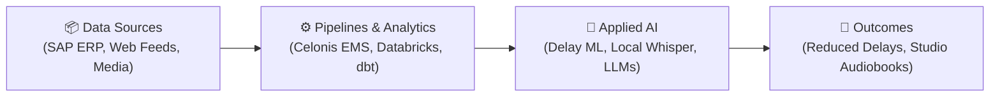

# Hi, I'm Azhar 👋

### Data Engineer • Celonis Process Mining Specialist

*Building practical data pipelines, process mining models, and automated AI tools.*

  
  
  

---

### 📊 System Architecture

---

### 🚀 Projects

#### **[O2C_AI](https://github.com/Az-har/O2C_AI)**
Enterprise Order-to-Cash (O2C) delay prediction and process intelligence engine. Built with Databricks, predictive machine learning on SAP data, and semantic contract retrieval to highlight delivery bottlenecks.  
`Databricks` • `Celonis / SAP` • `Python` • `XGBoost` • `RAG`

#### **[youtube-summarizer-audiobook](https://github.com/Az-har/youtube-summarizer-audiobook)**
Local multi-agent pipeline that downloads YouTube videos or playlists, transcribes speech with GPU-accelerated Whisper, runs an LLM editorial loop, and generates mastered audiobooks.  
`Whisper large-v3` • `AMD Vulkan` • `Ollama` • `FFmpeg`

#### **[automotive-analytics-project](https://github.com/Az-har/automotive-analytics-project)**
Modern data engineering pipeline modeling vehicle market data into dimensional star schemas using dbt and DuckDB.  
`dbt` • `DuckDB` • `SQL` • `Python`

#### **[scratchpad-python](https://github.com/Az-har/scratchpad-python)**
Curated collection of standalone Python scripts, including a real-time 3D spinning donut terminal animation, an image-to-ASCII converter, and CLI utilities.  
`Python` • `Algorithms` • `CLI Tools`

---

### 🛠️ Tech Stack

- **Process Mining**: Celonis EMS, PQL (Process Query Language), Action Engine, Event Log Modeling
- **Data Engineering**: Databricks, Apache Spark, dbt, DuckDB, Snowflake, PostgreSQL, Docker
- **Languages & Tools**: Python (Pandas, NumPy), SQL, Git, Linux / Bash

---

  

